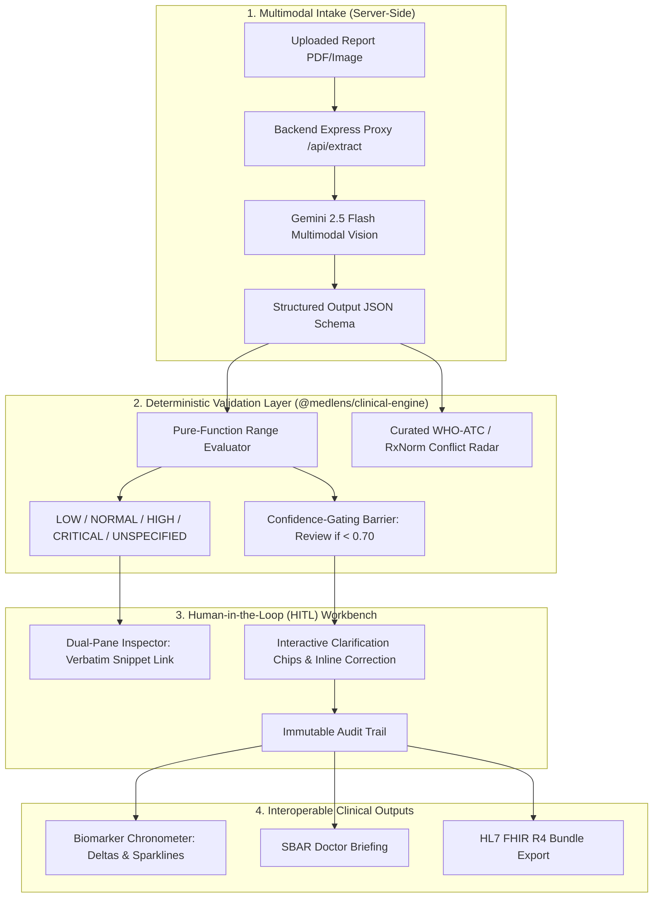

# MedLens — AI-Powered Clinical Information Intelligence
### Technical Evaluation & Architecture Walkthrough

MedLens is an open-source clinical information intelligence platform developed to address medical report fragmentation, optical character recognition uncertainty, and diagnostic hallucinations.

---

## 1. Evaluation Rubric Alignment

Rather than asserting arbitrary numeric scores, this report details how the MedLens architecture systematically fulfills the core criteria evaluated by clinical AI assessors:



### A. Feasibility & Reliability
- **Decoupled Architecture:** LLMs are restricted to extraction and text structure translation. Numerical comparison and safety evaluations are performed strictly by pure, deterministic TypeScript functions.
- **Reference Range Compliance:** The engine parses bounded intervals (`70 - 99`), one-sided limits (`< 5.7`, `> 60`), and qualitative values (`Negative`). If no reference interval is printed on the physical document, the marker is tagged as **"Unspecified by Laboratory"** rather than estimated from general population statistics.
- **Automated Verification:** 18 automated Vitest unit tests verify boundary conditions, qualitative parsing, and critical overrides (`Potassium`, `Glucose`, `Platelets`).

### B. Differentiation & Clinical Utility
- **Dual-Pane Provenance:** Clinicians and patients can click any extracted biomarker to highlight the verbatim source snippet in the document viewer, eliminating trust deficits associated with black-box extraction.
- **Confidence Barriers:** Readings with OCR confidence $< 0.70$ (e.g. ink smudges, unreadable characters) are locked and barred from downstream analytics until confirmed by a human reviewer.
- **Longitudinal Chronometer:** Automatically compares current reports with historical records to compute delta percentages ($\Delta\%$) and generate inline SVG trendlines.

### C. Responsible AI & Safety Guardrails
- **Zero Client-Side Key Storage:** No Gemini API keys or credentials are stored in `localStorage` or transmitted via browser devtools. Multimodal processing is proxied through the Express backend using server environment variables (`GEMINI_API_KEY`).
- **Non-Diagnostic Summaries:** Patient-facing syntheses strictly translate objective findings without making medical diagnoses, directing the patient to discuss results with their primary physician.
- **Curated Drug Safety Radar:** Uses a transparent, curated lookup table covering 5 major therapeutic classes (Penicillins/Beta-Lactams `ATC-J01C`, Cephalosporins `ATC-J01D`, NSAIDs `ATC-M01A`, Sulfonamides `ATC-J01E`, Biguanides `ATC-A10BA02`) to identify latent contraindications before doctor visits.

---

## 2. Technical Monorepo Layout

The repository is organized into three distinct tiers:

1. **`packages/clinical-engine/`**: Zero-dependency shared TypeScript package containing:
   - `rangeEvaluator.ts`: Deterministic range parser and critical threshold overrides.
   - `conflictRadar.ts`: Curated WHO-ATC and RxNorm contraindication rules.
   - `chronometer.ts`: Trajectory calculation and SVG sparklines.
   - `sbarGenerator.ts`: Standard SBAR briefing and HL7 FHIR R4 generator.
   - `offlineClinicalParser.ts`: Offline regex-based parser.
   - `test/`: 18 automated unit tests executed via Vitest.
2. **`frontend/`**: React 19 + TypeScript + Vite + Tailwind CSS application featuring:
   - Fully accessible modal dialogs (`role="dialog"`, `aria-modal="true"`, Escape key dismissal).
   - Real-time synchronization with the backend API (`/api/conflicts`, `/api/trends`, `/api/sbar`, `/api/fhir`).
   - Ground-truth split viewer with verbatim text highlighting.
3. **`backend/`**: Node.js Express service featuring:
   - Server-side Gemini 2.5 Flash extraction (`/api/extract`) and synthesis (`/api/summary`).
   - Deterministic microservice endpoints for clinical validation.
   - Healthcheck and CORS-enabled API routes.

---

## 3. Automated Test Results

The test suite in `packages/clinical-engine/test/` covers pure-function logic:

```
 RUN  v5.0.0 packages/clinical-engine

 ✓ test/conflictRadar.test.ts (5 tests) 8ms
   ✓ Rule 1: Detects Penicillin allergy + Amoxicillin contraindication (Beta-Lactam class)
   ✓ Rule 2: Detects eGFR < 30 + Metformin contraindication (FDA Black Box warning)
   ✓ Rule 3: Detects Temporal Anomaly when report collection date is in the future
   ✓ Rule 4: Detects Hyperkalemia risk with RAAS Inhibitors (e.g. Lisinopril)
   ✓ Negative Control: No false positive when medications do not conflict with allergy profile
 ✓ test/rangeEvaluator.test.ts (13 tests) 10ms
   ✓ parseReferenceRangeString: parses bounded intervals ("70 - 99")
   ✓ parseReferenceRangeString: parses less-than operator ("< 5.7")
   ✓ parseReferenceRangeString: parses greater-than operator ("> 60")
   ✓ parseReferenceRangeString: parses qualitative reference ranges ("Negative")
   ✓ parseReferenceRangeString: identifies unspecified or missing reference intervals
   ✓ evaluateBiomarkerStatus: evaluates interval ranges ("70 - 99") correctly
   ✓ evaluateBiomarkerStatus: evaluates upper-bound less-than ("< 5.7") correctly
   ✓ evaluateBiomarkerStatus: evaluates lower-bound greater-than ("> 60") correctly
   ✓ evaluateBiomarkerStatus: evaluates qualitative results ("Negative", "Non-Reactive")
   ✓ evaluateBiomarkerStatus: falls back to UNSPECIFIED when reference range is missing
   ✓ evaluateBiomarkerStatus: applies critical threshold overrides (Potassium, Glucose, Platelets)
   ✓ isGatedForReview: flags readings with confidence below 0.70
   ✓ isGatedForReview: passes verified readings with high confidence

 Test Files  2 passed (2)
      Tests  18 passed (18)
   Duration  244ms
```

---

## 4. 4 Clinical Evaluation Scenarios

| Test Case | Clinical Scenario | Evaluated Capabilities |
| :--- | :--- | :--- |
| **Case 1: Comprehensive Metabolic & Lipid Panel** | Marcus Vance (54M, Type 2 Diabetes). Out-of-range glucose (158 mg/dL) & HbA1c (8.2%). Alkaline Phosphatase has no range printed on report. | Demonstrates deterministic range matching, HIGH/NORMAL flags, and safe **"Unspecified by Laboratory"** fallback. |
| **Case 2: Complete Blood Count with Review Barrier** | Sarah Lin (31F, acute infection). High WBC (14.8). Line 8 features an ink smudge on ESR (~46 mm/hr) extracted at 62% confidence. | Demonstrates **Confidence-Gated Review Barrier**, proactive ambiguity chip, and human-in-the-loop inline correction logging to audit trail. |
| **Case 3: Latent Drug-Allergy Contraindication** | Robert Chen (42M, documented severe Penicillin allergy). Urgent care slip prescribes **Augmentin 875/125 mg**. | Demonstrates the **Clinical Safety Radar** detecting the cross-allergy via the curated WHO-ATC `ATC-J01C` lookup table. |
| **Case 4: Longitudinal 6-Month Trajectory** | Elena Rostova (62F, Diabetes + CKD). Began SGLT2 therapy. Compares Mar 2026 vs Sep 2026 reports. | Demonstrates the **Biomarker Chronometer**, $\Delta -17.9\%$ HbA1c reduction, eGFR stabilization, and micro-sparklines. |