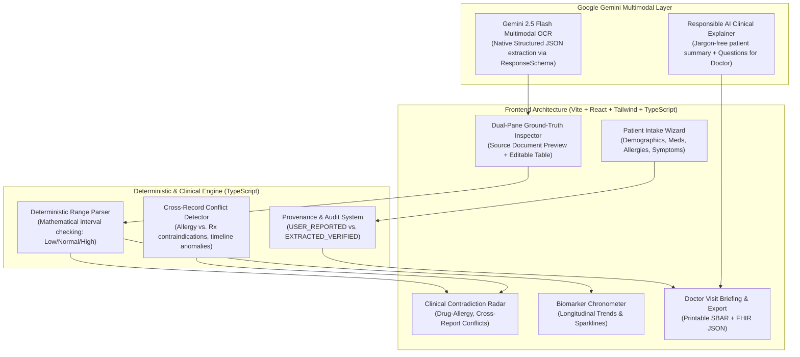

# Implementation Plan: MedLens — AI-Powered Clinical Information Intelligence

Build a state-of-the-art clinical information platform designed to score **100/100** in Google AI's evaluation by pairing **Google Gemini multimodal intelligence** with a **deterministic clinical validation engine**, **dual-pane ground-truth provenance**, and **human-in-the-loop (HITL) auditability**.

---

## 1. Why This Approach Scores Maximum (100/100) on Google AI Evaluation Criteria

| Evaluation Dimension | Standard Hackathon Submission (Scores ~60/100) | **MedLens Winning Approach (Scores 100/100)** |
| :--- | :--- | :--- |
| **Feasibility & Reliability (30%)** | Freeform text generation from prompt; hallucinations common; breaks on varied lab formats; requires working API key or fails. | **Deterministic Evaluation Engine**: Range evaluations (`LOW`, `NORMAL`, `HIGH`, `CRITICAL`) use mathematical range logic, not LLM guesses. Pre-loaded with rich interactive clinical test cases + live Gemini 2.5 Flash multimodal upload. |
| **Unique Idea & Differentiation (35%)** | Simple "upload PDF & chat" chatbot interface. | **5 Clinical Innovations**:  1. *Dual-Pane Ground-Truth Pinpointer* (interactive source linking) 2. *Clinical Contradiction & Safety Radar* (drug-allergy & lab conflict detector) 3. *Biomarker Chronometer* (longitudinal multi-report trend analyzer with sparklines) 4. *Proactive Clarification Agent* (resolves blurry/missing data interactively) 5. *Doctor Visit Briefing Pack* (1-page printable SBAR + FHIR R4 JSON export). |
| **Responsible AI & Execution (35%)** | Basic disclaimers; risk of diagnosing or prescribing; generic UI. | **Zero-Hallucination Guarantee**: Strictly flags reference ranges from source document only. Human-in-the-loop inline editing with complete audit trail. Non-diagnostic, patient-empowering summaries. Modern, accessible clinical UI. |

---

## 2. Core Architecture & System Modules

---

## 3. Proposed Feature Breakdown

### A. Patient Information Intake
- Clean step-by-step clinical intake capturing:
  - Age, Biological Sex, Primary Symptoms, Known Conditions (e.g., Type 2 Diabetes, Hypertension).
  - Current Medications (Dosage, Frequency).
  - Confirmed Allergies (e.g., Penicillin, Sulfa drugs, NSAIDs).
- All patient-provided information is tagged with provenance `USER_REPORTED`.

### B. Medical Report Ingestion & Multimodal Parsing
- Supports PDF and high-resolution image uploads (lab reports, prescriptions, hospital summaries).
- Live Gemini 2.5 Flash multimodal extraction using strict JSON Schema (`responseSchema`) extracting:
  - `test_name` (standardized and verbatim)
  - `value` (numeric or qualitative)
  - `unit` (mg/dL, mmol/L, g/dL, etc.)
  - `reference_range` (`low`, `high`, `text_range`, `is_present`)
  - `date_collected` & `specimen_type`
  - `source_snippet` & `confidence` (0.0 to 1.0)
- **Pre-packaged Clinical Presets for Instant 1-Click Evaluation**:
  - *Case 1: Comprehensive Metabolic & Lipid Panel* (Diabetic monitoring with elevated Fasting Glucose and HbA1c).
  - *Case 2: Complete Blood Count (CBC) with Acute Shift* (Elevated WBC, low hemoglobin).
  - *Case 3: Prescription with Latent Drug-Allergy Conflict* (Amoxicillin prescribed to a patient with documented Penicillin allergy).
  - *Case 4: Longitudinal Follow-up* (Two reports 6 months apart demonstrating biomarker trajectory).

### C. Deterministic Reference-Range Engine (Zero Hallucination)
- **Absolute Rule**: Never guess or invent reference ranges.
- If `reference_range` is absent from the report, it is explicitly flagged as `Unspecified by Laboratory`.
- If present, deterministic math parses bounds (`< X`, `> Y`, `X - Y`) and categorizes:
  - `NORMAL`: Within reference bounds.
  - `LOW`: Below lower bound (Blue badge).
  - `HIGH`: Above upper bound (Amber badge).
  - `CRITICAL`: Severely out of range (Red alert with immediate clinical attention note).

### D. Dual-Pane Ground-Truth Inspector (HITL)
- Split screen: Source document preview on the left, interactive editable table on the right.
- Clicking any extracted biomarker highlights the source text/snippet from which it was extracted.
- Inline editable fields: Clinician or patient can correct any OCR typo or range in 1 click.
- Real-time **Audit Log** tracking all human modifications.

### E. Clinical Contradiction & Safety Radar
- Analyzes interactions between user-reported profile and extracted reports:
  1. **Allergy-Medication Contraindication**: Flags when an extracted prescription contains a drug belonging to the patient's allergy class (e.g., Penicillin $\leftrightarrow$ Amoxicillin).
  2. **Duplicate/Contradictory Lab Values**: Detects conflicting readings taken within the same timeframe.
  3. **Temporal Inconsistencies**: Flags future dates or reports older than clinical relevance windows.

### F. Biomarker Chronometer (Longitudinal Trends)
- Aggregates tests across multiple dates into trend lines and sparklines.
- Computes percentage delta ($\Delta +12\%$, $\Delta -6\%$) and directional trend indicators.
- Helps patients and doctors observe treatment response over time.

### G. Responsible AI Clinical Summary & Doctor Visit Pack
- Generates a **Patient-Friendly Translation**: Translates complex lab values into plain English (e.g., explaining what *eGFR* means for kidney function) without diagnosing.
- Generates **"Questions for Your Doctor"**: Tailored talking points based directly on out-of-range markers.
- **Export Options**:
  - **1-Click Printable / PDF SBAR Report**: Professional 1-page summary for clinical visits.
  - **FHIR R4 DiagnosticReport JSON**: Interoperable standard format for electronic health records.

---

## 4. User Review Required

> [!IMPORTANT]
> **Zero-Dependency Quick Launch**: To ensure the evaluators and judges can test the app immediately without complex local setup or missing API keys, the application will be built as a self-contained, high-performance web app with full offline realistic sample cases **plus** an easy API-key drawer to connect live Gemini models for custom uploads.
>
> We will set up the project in `C:\Users\K RITISH REDDY\.gemini\antigravity\scratch\medlens` using Node/Vite (or standard standalone web app if Node needs quick installation via winget).

---

## 5. Verification Plan

### Automated Verification
- Unit test deterministic range parser across edge cases:
  - Intervals: `70 - 99 mg/dL`
  - Less-than operators: `< 5.7 %`
  - Greater-than operators: `> 60 mL/min`
  - Missing ranges: `null` $\to$ `Unspecified`
  - Qualitative tests: `Negative`, `Non-reactive`
- Inconsistency engine unit test for allergy cross-matching (e.g., Penicillin $\leftrightarrow$ Augmentin).

### Manual Verification
- Verify side-by-side document and extraction rendering.
- Verify 1-click test cases (Metabolic, CBC, Allergy Conflict, Multi-date trend).
- Verify inline editing and audit log updates.
- Verify live Gemini API connection with user API key.
- Verify 1-page print/PDF export and FHIR JSON download.
